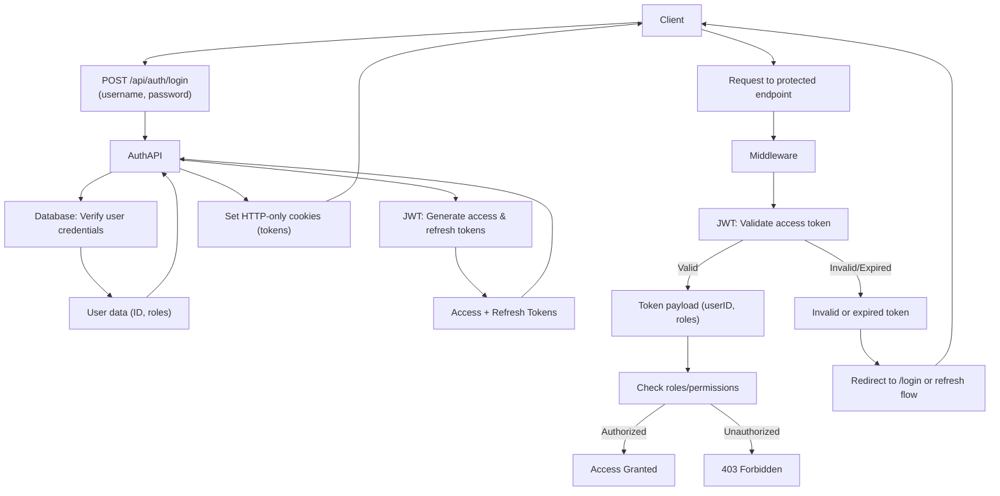
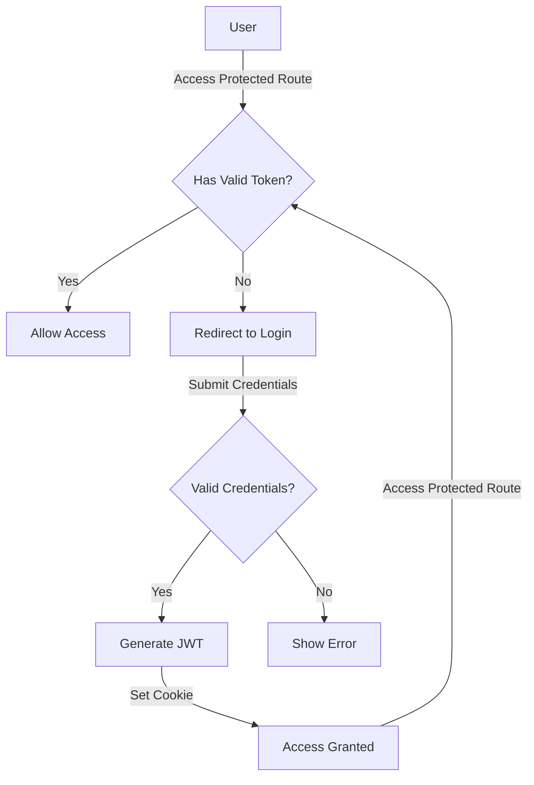

# JWT Authentication System Documentation

## 🏗️ Architecture Overview

The authentication system implements a secure JWT-based authentication flow using Next.js, with HTTP-only cookies for token storage. Here's a detailed breakdown of the system:



## 📁 File Structure and Implementation

### 1. Database Models

<details>
<summary>👤 User Model (lib/models/User.ts)</summary>

```typescript
// Mongoose is used to define and interact with MongoDB models
import mongoose, { Document, Schema } from 'mongoose';

// bcryptjs is used to securely hash and compare passwords
import bcrypt from 'bcryptjs';

// User interface with a method for comparing passwords
export interface IUser extends Document {
  email: string;
  password: string;
  name: string;
  createdAt: Date;
  comparePassword(candidatePassword: string): Promise<boolean>;
}

// Define the User schema with validation and default values
const UserSchema = new Schema<IUser>({
  email: {
    type: String,
    required: [true, 'Email is required'],
    unique: true,
    lowercase: true,
  },
  password: {
    type: String,
    required: [true, 'Password is required'],
    minlength: 6,
  },
  name: {
    type: String,
    required: [true, 'Name is required'],
  },
  createdAt: {
    type: Date,
    default: Date.now,
  },
});

// Middleware that hashes the password before saving to the database
UserSchema.pre('save', async function (next) {
  // Only hash if the password was modified or is new
  if (!this.isModified('password')) return next();

  // Hash the password using bcrypt with 12 salt rounds
  this.password = await bcrypt.hash(this.password, 12);
  next();
});

// Instance method to compare entered password with the stored hashed password
UserSchema.methods.comparePassword = async function (candidatePassword: string): Promise<boolean> {
  return bcrypt.compare(candidatePassword, this.password);
};

// Export the User model, reusing an existing one if already compiled by Mongoose
const User = mongoose.models.User || mongoose.model<IUser>('User', UserSchema);

export default User;

```
</details>

### 2. Database Connection

<details>
<summary>🔌 Database Connection (lib/db.ts)</summary>

```typescript
// Import Mongoose for MongoDB connection management
import mongoose from 'mongoose';

// Get the MongoDB connection URI from environment variables
const MONGODB_URI = process.env.MONGODB_URI!;

// Ensure the URI is defined; throw an error if missing
if (!MONGODB_URI) {
  throw new Error('Please define the MONGODB_URI environment variable');
}

// Use a global cache to store the connection across hot reloads in development
let cached = (global as any).mongoose;

// If the cache doesn't exist, initialize it
if (!cached) {
  cached = (global as any).mongoose = { conn: null, promise: null };
}

// Function to establish and cache a MongoDB connection
async function dbConnect() {
  // If a cached connection exists, return it immediately
  if (cached.conn) {
    return cached.conn;
  }

  // If no existing promise, start connecting
  if (!cached.promise) {
    const opts = {
      bufferCommands: false, // Disable mongoose command buffering
    };

    // Create and store a new connection promise
    cached.promise = mongoose.connect(MONGODB_URI, opts).then((mongoose) => {
      return mongoose;
    });
  }

  try {
    // Await the connection and store it in the cache
    cached.conn = await cached.promise;
  } catch (e) {
    // Reset the promise on error to allow retries
    cached.promise = null;
    throw e;
  }

  // Return the established connection
  return cached.conn;
}

// Export the dbConnect function for use in the application
export default dbConnect;

```
</details>

### 3. Type Definitions

<details>
<summary>📝 Authentication Types (types/auth.ts)</summary>

```typescript
export interface User {
  id: string;
  email: string;
  name: string;
}

export interface AuthContextType {
  user: User | null;
  login: (email: string, password: string) => Promise<void>;
  register: (name: string, email: string, password: string) => Promise<void>;
  logout: () => void;
  loading: boolean;
}

export interface LoginCredentials {
  email: string;
  password: string;
}

export interface RegisterCredentials {
  name: string;
  email: string;
  password: string;
}
```
</details>

### 4. Authentication Pages

<details>
<summary>🔑 Login Page (app/auth/login/page.tsx)</summary>

```typescript
"use client" // Enables client-side rendering for this component

import type React from "react"
import { useState } from "react"
import { useRouter } from "next/navigation" // For client-side navigation
import Link from "next/link"

// UI components from your design system
import { Input } from "@/components/ui/input"
import { Button } from "@/components/ui/button"
import { Card, CardContent, CardHeader } from "@/components/ui/card"

// Icons from Lucide for user/avatar and password visibility toggles
import { User, Eye, EyeOff } from "lucide-react"

export default function LoginPage() {
  const [email, setEmail] = useState("")
  const [password, setPassword] = useState("")
  const [error, setError] = useState("")
  const [loading, setLoading] = useState(false)
  const [showPassword, setShowPassword] = useState(false)

  const router = useRouter()

  // Handle form submission for login
  const handleSubmit = async (e: React.FormEvent) => {
    e.preventDefault()
    setError("")
    setLoading(true)

    try {
      // Send login request to the backend API
      const response = await fetch("/api/auth/login", {
        method: "POST",
        headers: { "Content-Type": "application/json" },
        body: JSON.stringify({ email, password }),
      })

      const data = await response.json()

      if (!response.ok) {
        throw new Error(data.error || "Login failed")
      }

      // Redirect to dashboard on successful login
      router.push("/dashboard")
      router.refresh()
    } catch (error) {
      // Handle and display error
      setError(error instanceof Error ? error.message : "Login failed")
    } finally {
      setLoading(false)
    }
  }

  return (
    <div className="min-h-screen bg-gradient-to-br from-slate-50 to-slate-100 flex items-center justify-center py-12 px-4 sm:px-6 lg:px-8">
      <div className="max-w-md w-full space-y-8">

        {/* Avatar and App Branding */}
        <div className="text-center">
          <div className="mx-auto h-20 w-20 bg-gradient-to-br from-blue-500 to-blue-600 rounded-full flex items-center justify-center mb-6 shadow-lg">
            <User className="h-10 w-10 text-white" />
          </div>
          <h1 className="text-2xl font-bold text-gray-800 mb-2">
            Tensor Vision X
          </h1>
          <h2 className="text-xl font-semibold text-gray-700">Sign in to your account</h2>
          <p className="text-sm text-gray-500 mt-2">Welcome back! Please enter your details.</p>
        </div>

        {/* Login Form Card */}
        <Card className="shadow-xl border-0 bg-white/80 backdrop-blur-sm">
          <CardHeader className="pb-4">
            {/* Error display if login fails */}
            {error && (
              <div className="p-4 bg-red-50 border border-red-200 text-red-700 rounded-lg text-sm">{error}</div>
            )}
          </CardHeader>
          <CardContent>
            <form onSubmit={handleSubmit} className="space-y-6">
              <div className="space-y-4">

                {/* Email input */}
                <div>
                  <label htmlFor="email" className="block text-sm font-medium text-gray-700 mb-2">
                    Email address
                  </label>
                  <Input
                    id="email"
                    type="email"
                    value={email}
                    onChange={(e) => setEmail(e.target.value)}
                    required
                    placeholder="you@example.com"
                    className="h-12 border-gray-200 focus:border-blue-500 focus:ring-blue-500"
                  />
                </div>

                {/* Password input with show/hide toggle */}
                <div>
                  <label htmlFor="password" className="block text-sm font-medium text-gray-700 mb-2">
                    Password
                  </label>
                  <div className="relative">
                    <Input
                      id="password"
                      type={showPassword ? "text" : "password"}
                      value={password}
                      onChange={(e) => setPassword(e.target.value)}
                      required
                      placeholder="Enter your password"
                      className="h-12 border-gray-200 focus:border-blue-500 focus:ring-blue-500 pr-12"
                    />
                    {/* Show/Hide password button */}
                    <button
                      type="button"
                      onClick={() => setShowPassword(!showPassword)}
                      className="absolute right-3 top-1/2 transform -translate-y-1/2 text-gray-400 hover:text-gray-600"
                    >
                      {showPassword ? <EyeOff className="h-5 w-5" /> : <Eye className="h-5 w-5" />}
                    </button>
                  </div>
                </div>

                {/* Submit button with loading spinner */}
                <Button
                  type="submit"
                  disabled={loading}
                  className="w-full h-12 bg-gradient-to-r from-blue-600 to-blue-600 hover:from-blue-700 hover:to-blue-700 text-white font-medium rounded-lg shadow-lg hover:shadow-xl transition-all duration-200"
                >
                  {loading ? (
                    <div className="flex items-center">
                      <div className="animate-spin rounded-full h-4 w-4 border-b-2 border-white mr-2"></div>
                      Signing in...
                    </div>
                  ) : (
                    "Sign in"
                  )}
                </Button>
              </div>

              {/* Link to registration page */}
              <div className="text-center pt-4 border-t border-gray-100">
                <p className="text-sm text-gray-600">
                  {"Don't have an account?"}{" "}
                  <Link
                    href="/auth/register"
                    className="font-medium text-blue-600 hover:text-blue-500 transition-colors"
                  >
                    Sign up
                  </Link>
                </p>
              </div>
            </form>
          </CardContent>
        </Card>

        {/* Footer note */}
        <div className="text-center">
          <p className="text-xs text-gray-400">Secure authentication powered by JWT auth</p>
        </div>
      </div>
    </div>
  )
}

```
</details>

<details>
<summary>📝 Register Page (app/auth/register/page.tsx)</summary>

```typescript
"use client" // Marks this file as a Client Component in Next.js App Router

import type React from "react"

import { useState } from "react"
import { useRouter } from "next/navigation" // Used for programmatic navigation
import Link from "next/link" // Provides client-side transitions between routes

// UI components from your component library
import { Input } from "@/components/ui/input"
import { Button } from "@/components/ui/button"
import { Card, CardContent, CardHeader } from "@/components/ui/card"

// Lucide icons for UI interactions
import { User, Eye, EyeOff } from "lucide-react"

export default function RegisterPage() {
  // State variables to track user input, loading, error, and password visibility
  const [name, setName] = useState("")
  const [email, setEmail] = useState("")
  const [password, setPassword] = useState("")
  const [error, setError] = useState("")
  const [loading, setLoading] = useState(false)
  const [showPassword, setShowPassword] = useState(false)

  const router = useRouter() // Used to redirect user after successful registration

  // Handles form submission to register the user
  const handleSubmit = async (e: React.FormEvent) => {
    e.preventDefault()
    setError("")
    setLoading(true)

    try {
      // Send registration data to the API
      const response = await fetch("/api/auth/register", {
        method: "POST",
        headers: { "Content-Type": "application/json" },
        body: JSON.stringify({ name, email, password }),
      })

      const data = await response.json()

      if (!response.ok) {
        // Handle server-side validation or error
        throw new Error(data.error || "Registration failed")
      }

      // Redirect to dashboard on success
      router.push("/dashboard")
      router.refresh()
    } catch (error) {
      // Display a user-friendly error message
      setError(error instanceof Error ? error.message : "Registration failed")
    } finally {
      setLoading(false)
    }
  }

  return (
    <div className="min-h-screen bg-gradient-to-br from-slate-50 to-slate-100 flex items-center justify-center py-12 px-4 sm:px-6 lg:px-8">
      <div className="max-w-md w-full space-y-8">

        {/* Branding and welcome section */}
        <div className="text-center">
          <div className="mx-auto h-20 w-20 bg-gradient-to-br from-blue-500 to-blue-600 rounded-full flex items-center justify-center mb-6 shadow-lg">
            <User className="h-10 w-10 text-white" />
          </div>
          <h1 className="text-2xl font-bold text-gray-800 mb-2">
            Tensor Vision X
          </h1>
          <h2 className="text-xl font-semibold text-gray-700">Create your account</h2>
          <p className="text-sm text-gray-500 mt-2">Join us today! Please fill in your details to get started.</p>
        </div>

        {/* Registration form card */}
        <Card className="shadow-xl border-0 bg-white/80 backdrop-blur-sm">
          <CardHeader className="pb-4">
            {/* Display error message if any */}
            {error && (
              <div className="p-4 bg-red-50 border border-red-200 text-red-700 rounded-lg text-sm">{error}</div>
            )}
          </CardHeader>
          <CardContent>
            <form onSubmit={handleSubmit} className="space-y-6">
              <div className="space-y-4">
                {/* Full name input */}
                <div>
                  <label htmlFor="name" className="block text-sm font-medium text-gray-700 mb-2">
                    Full name
                  </label>
                  <Input
                    id="name"
                    type="text"
                    value={name}
                    onChange={(e) => setName(e.target.value)}
                    required
                    placeholder="John Doe"
                    className="h-12 border-gray-200 focus:border-blue-500 focus:ring-blue-500"
                  />
                </div>

                {/* Email input */}
                <div>
                  <label htmlFor="email" className="block text-sm font-medium text-gray-700 mb-2">
                    Email address
                  </label>
                  <Input
                    id="email"
                    type="email"
                    value={email}
                    onChange={(e) => setEmail(e.target.value)}
                    required
                    placeholder="you@example.com"
                    className="h-12 border-gray-200 focus:border-blue-500 focus:ring-blue-500"
                  />
                </div>

                {/* Password input with show/hide toggle */}
                <div>
                  <label htmlFor="password" className="block text-sm font-medium text-gray-700 mb-2">
                    Password
                  </label>
                  <div className="relative">
                    <Input
                      id="password"
                      type={showPassword ? "text" : "password"}
                      value={password}
                      onChange={(e) => setPassword(e.target.value)}
                      required
                      placeholder="At least 6 characters"
                      className="h-12 border-gray-200 focus:border-blue-500 focus:ring-blue-500 pr-12"
                    />
                    {/* Toggle password visibility */}
                    <button
                      type="button"
                      onClick={() => setShowPassword(!showPassword)}
                      className="absolute right-3 top-1/2 transform -translate-y-1/2 text-gray-400 hover:text-gray-600"
                    >
                      {showPassword ? <EyeOff className="h-5 w-5" /> : <Eye className="h-5 w-5" />}
                    </button>
                  </div>
                </div>

                {/* Submit button */}
                <Button
                  type="submit"
                  disabled={loading}
                  className="w-full h-12 bg-gradient-to-r from-blue-600 to-blue-600 hover:from-blue-700 hover:to-blue-700 text-white font-medium rounded-lg shadow-lg hover:shadow-xl transition-all duration-200"
                >
                  {loading ? (
                    <div className="flex items-center">
                      <div className="animate-spin rounded-full h-4 w-4 border-b-2 border-white mr-2"></div>
                      Creating account...
                    </div>
                  ) : (
                    "Sign up"
                  )}
                </Button>
              </div>

              {/* Link to login page */}
              <div className="text-center pt-4 border-t border-gray-100">
                <p className="text-sm text-gray-600">
                  Already have an account?{" "}
                  <Link
                    href="/auth/login"
                    className="font-medium text-blue-600 hover:text-blue-500 transition-colors"
                  >
                    Sign in
                  </Link>
                </p>
              </div>
            </form>
          </CardContent>
        </Card>

        {/* Footer note */}
        <div className="text-center">
          <p className="text-xs text-gray-400">Secure authentication powered by JWT auth</p>
        </div>
      </div>
    </div>
  )
}

```
</details>

<details>
<summary>🏠 Dashboard Page (app/dashboard/page.tsx)</summary>

```typescript
import { getCurrentUser } from '@/lib/auth';
import { redirect } from 'next/navigation';
import { Dashboard } from "@/components/dashboard"

export default async function Home() {
  const user = await getCurrentUser();

  if (!user) {
    redirect('/auth/login');
  }

  return (
    <div className="min-h-screen flex flex-col">
      <Dashboard />
    </div>
  )
}

```
</details>

### 5. API Routes

<details>
<summary>🔒 Login Route (app/api/auth/login/route.ts)</summary>

```typescript
import { NextRequest, NextResponse } from 'next/server';
import dbConnect from '@/lib/db';
import User from '@/lib/models/User';
import { generateToken } from '@/lib/auth';

export async function POST(request: NextRequest) {
  try {
    await dbConnect();

    const { email, password } = await request.json();

    // Validation
    if (!email || !password) {
      return NextResponse.json(
        { error: 'Email and password are required' },
        { status: 400 }
      );
    }

    // Find user
    const user = await User.findOne({ email });
    if (!user) {
      return NextResponse.json(
        { error: 'Invalid credentials' },
        { status: 401 }
      );
    }

    // Check password
    const isPasswordValid = await user.comparePassword(password);
    if (!isPasswordValid) {
      return NextResponse.json(
        { error: 'Invalid credentials' },
        { status: 401 }
      );
    }

    // Generate JWT token
    const token = await generateToken({
      userId: user._id.toString(),
      email: user.email,
      name: user.name,
    });

    // Set HTTP-only cookie
    const response = NextResponse.json(
      {
        message: 'Login successful',
        user: {
          id: user._id,
          name: user.name,
          email: user.email,
        },
      },
      { status: 200 }
    );

    response.cookies.set('token', token, {
      httpOnly: true,
      secure: true,
      sameSite: 'lax',
      path: '/',
      maxAge: 60 * 60 * 24 * 7,
    });

    return response;
  } catch (error) {
    console.error('Login error:', error);
    return NextResponse.json(
      { error: 'Internal server error' },
      { status: 500 }
    );
  }
}
```
</details>

<details>
<summary>🚪 Logout Route (app/api/auth/logout/route.ts)</summary>

```typescript
import { NextResponse } from 'next/server';

export async function POST() {
  // Create a JSON response confirming logout
  const response = NextResponse.json(
    { message: 'Logout successful' },
    { status: 200 }
  );

  // Clear the authentication cookie by setting it empty and expiring it immediately
  response.cookies.set('token', '', {
    httpOnly: true,                                // Keep it inaccessible to JavaScript
    secure: process.env.NODE_ENV === 'production', // Use HTTPS only in production
    sameSite: 'strict',                            // Strict same-site policy for security
    maxAge: 0,                                     // Expire cookie immediately
  });

  return response;
}

```
</details>

<details>
<summary>📝 Register Route (app/api/auth/register/route.ts)</summary>

```typescript
import { NextRequest, NextResponse } from 'next/server'; // Next.js API utilities
import dbConnect from '@/lib/db'; // MongoDB connection helper
import User from '@/lib/models/User'; // Mongoose User model
import { generateToken } from '@/lib/auth'; // JWT generation helper

export async function POST(request: NextRequest) {
  try {
    // Connect to MongoDB
    await dbConnect();

    // Parse request body
    const { name, email, password } = await request.json();

    // Validate required fields
    if (!name || !email || !password) {
      return NextResponse.json(
        { error: 'All fields are required' },
        { status: 400 }
      );
    }

    // Enforce minimum password length
    if (password.length < 6) {
      return NextResponse.json(
        { error: 'Password must be at least 6 characters' },
        { status: 400 }
      );
    }

    // Check for existing user with same email
    const existingUser = await User.findOne({ email });
    if (existingUser) {
      return NextResponse.json(
        { error: 'User already exists' },
        { status: 400 }
      );
    }

    // Create new user document (password hashing handled in schema middleware)
    const user = new User({ name, email, password });
    await user.save();

    // Generate JWT token for the new user
    const token = await generateToken({
      userId: user._id.toString(),
      email: user.email,
      name: user.name,
    });

    // Prepare response with user info
    const response = NextResponse.json(
      {
        message: 'User created successfully',
        user: {
          id: user._id,
          name: user.name,
          email: user.email,
        },
      },
      { status: 201 }
    );

    // Set HTTP-only cookie with JWT token for authentication
    response.cookies.set('token', token, {
      httpOnly: true,      // Secure from client-side JS
      secure: true,        // Only send over HTTPS
      sameSite: 'lax',     // Moderate CSRF protection
      path: '/',           // Available site-wide
      maxAge: 60 * 60 * 24 * 7, // 7 days expiry
    });

    return response;
  } catch (error) {
    // Log and return generic server error for unhandled issues
    console.error('Registration error:', error);
    return NextResponse.json(
      { error: 'Internal server error' },
      { status: 500 }
    );
  }
}

```
</details>

### 6. Authentication Library

<details>
<summary>🔑 Auth Utilities (lib/auth.ts)</summary>

```typescript
import { SignJWT, jwtVerify } from 'jose'; // JOSE library for JWT signing and verification
import { cookies } from 'next/headers';   // Next.js helper to read cookies in server components or API routes

// Secret key used for signing and verifying JWTs (encoded as Uint8Array)
const JWT_SECRET = new TextEncoder().encode(process.env.JWT_SECRET!);

export interface JWTPayload {
  userId: string;
  email: string;
  name: string;
  [key: string]: string;
}

// Generate a signed JWT token with a payload containing user info
export async function generateToken(payload: JWTPayload): Promise<string> {
  return await new SignJWT({
    userId: payload.userId,
    email: payload.email,
    name: payload.name
  })
    .setProtectedHeader({ alg: 'HS256' }) // HMAC SHA-256 algorithm
    .setExpirationTime('7d')               // Token expires in 7 days
    .sign(JWT_SECRET);
}

// Verify the JWT token, returning the payload if valid, otherwise null
export async function verifyToken(token: string): Promise<JWTPayload | null> {
  try {
    const { payload } = await jwtVerify(token, JWT_SECRET);
    const jwtPayload = payload as Record<string, string>;

    // Validate required fields in payload
    if (!jwtPayload.userId || !jwtPayload.email || !jwtPayload.name) {
      return null;
    }

    return {
      userId: jwtPayload.userId,
      email: jwtPayload.email,
      name: jwtPayload.name
    };
  } catch (error) {
    // Invalid token or verification failed
    return null;
  }
}

// Retrieve current user info from the HTTP-only cookie token
export async function getCurrentUser(): Promise<JWTPayload | null> {
  try {
    const cookieStore = await cookies(); // Read cookies from request context
    const token = cookieStore.get('token')?.value;

    if (!token) return null;

    // Verify and decode token to get user data
    return await verifyToken(token);
  } catch (error) {
    return null;
  }
}

```
</details>

### 7. Middleware Protection

<details>
<summary>🛡️ Route Protection (middleware.ts)</summary>

```typescript
import { NextResponse } from 'next/server';
import type { NextRequest } from 'next/server';
import { verifyToken } from './lib/auth'; // JWT verification helper

export async function middleware(request: NextRequest) {
  // Get JWT token from cookies
  const token = request.cookies.get('token')?.value;
  const { pathname } = request.nextUrl;

  // Define protected routes that require authentication
  const protectedRoutes = ['/dashboard'];

  // Define authentication routes for login/register pages
  const authRoutes = ['/auth/login', '/auth/register'];

  // Check if the current path is protected or auth route
  const isProtectedRoute = protectedRoutes.some(route => pathname.startsWith(route));
  const isAuthRoute = authRoutes.some(route => pathname.startsWith(route));

  // If accessing protected route without token, redirect to login page
  if (isProtectedRoute && !token) {
    return NextResponse.redirect(new URL('/auth/login', request.url));
  }

  // If accessing auth route while logged in (token present), redirect to dashboard
  if (isAuthRoute && token) {
    try {
      // Verify token validity
      const payload = await verifyToken(token);
      if (payload) {
        // Valid token found, redirect away from login/register to dashboard
        return NextResponse.redirect(new URL('/dashboard', request.url));
      }
    } catch (error) {
      // On error verifying token, clear cookie and redirect to login
      const response = NextResponse.redirect(new URL('/auth/login', request.url));
      response.cookies.delete('token');
      return response;
    }
  }

  // For all other cases, allow request to proceed
  return NextResponse.next();
}

export const config = {
  // Apply middleware only to dashboard and auth routes
  matcher: ['/dashboard/:path*', '/auth/:path*']
};

```
</details>

## 🔒 Security Features

1. **HTTP-only Cookies**: Prevents XSS attacks by making tokens inaccessible to JavaScript
2. **Secure Cookie Flag**: Ensures cookies are only sent over HTTPS in production
3. **SameSite Policy**: Protects against CSRF attacks
4. **Token Expiration**: JWTs expire after 7 days
5. **Password Hashing**: User passwords are hashed using bcrypt before storage
6. **Protected Routes**: Middleware ensures authenticated access to sensitive routes
7. **MongoDB Connection Pooling**: Efficient database connection management
8. **Type Safety**: TypeScript interfaces ensure type safety across the application

## 🔄 Authentication Flow



This implementation provides a secure, stateless authentication system using modern best practices and Next.js features. The use of HTTP-only cookies for token storage, combined with middleware route protection and proper error handling, creates a robust authentication layer for the application.