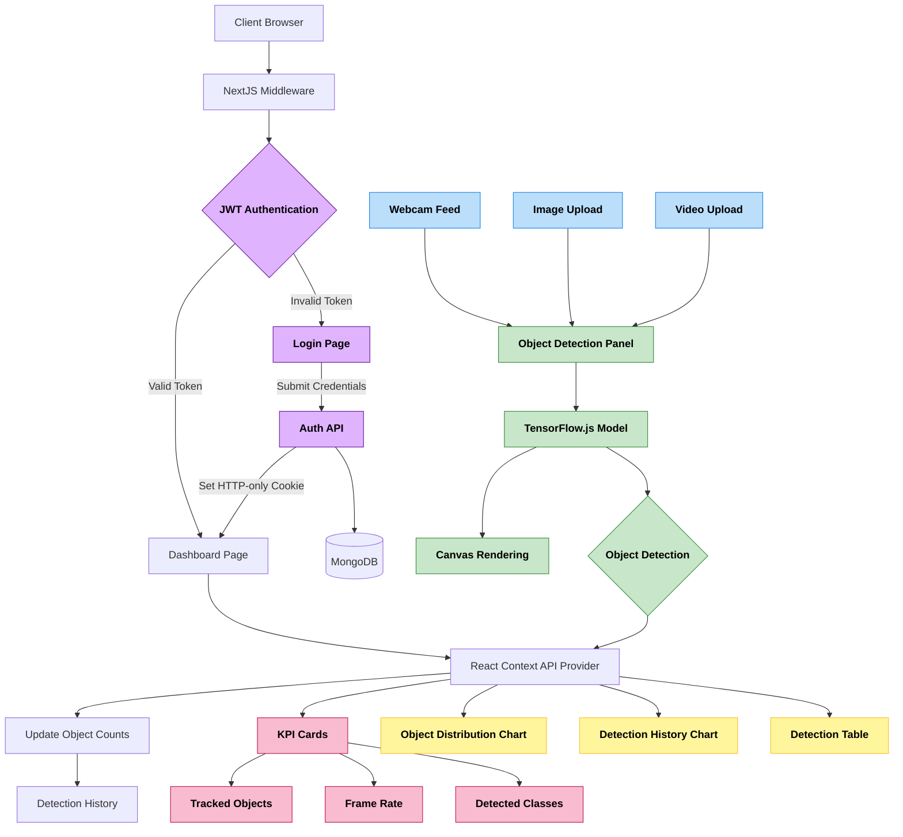

# 🎯 TensorVision X - Real-Time Object Detection Platform

- 🌐 [**Live Deployed Website**](https://tensor-vision-x.vercel.app/)
- 📺 [**TensorVisionX Web App Demo Video**](https://youtu.be/5M3eyTGb-W4)

## 📚 Table of Contents

- [Key Features](https://github.com/rakheshkrishna2005/TensorVisionX?tab=readme-ov-file#-key-features)
- [Tech Stack](https://github.com/rakheshkrishna2005/TensorVisionX?tab=readme-ov-file#️-tech-stack)
- [Core Modules](https://github.com/rakheshkrishna2005/TensorVisionX?tab=readme-ov-file#-core-modules)
- [System Architecture](https://github.com/rakheshkrishna2005/TensorVisionX?tab=readme-ov-file#️-system-architecture)
- [UI Snapshots](https://github.com/rakheshkrishna2005/TensorVisionX?tab=readme-ov-file#-ui-snapshots)
  
## 🚀 Key Features

* 📸 **Real-Time Detection** — Powered by **TensorFlow.js** COCO-SSD model
* 🎥 **Multi-Source Input** — Support for webcam, image upload, and video upload
* 📊 **Rich Analytics** — Real-time statistics, distribution charts, and historical data
* 🎨 **Modern UI** — Built with **Next.js**, **Tailwind CSS**, and **shadcn/ui**

## ⚙️ Tech Stack

| Layer      | Technologies                                               |
|------------|----------------------------------------------------------|
| 🧠 Computer Vision   | `TensorFlow.js`                         |
| 🖥️ Frontend| `Next.js`, `TypeScript`, `TailwindCSS`, `shadcn/ui`    |
| 🔒 Auth    | `JWT`, `HTTP-only Cookies`, `MongoDB`                     |
| 📊 Charts  | `Recharts`, `Custom Canvas Rendering`                     |

## 🧩 Core Modules

### 🎯 Object Detection Engine
* Real-time inference using TensorFlow.js
* Custom canvas rendering pipeline
* Playback on uploaded video feed

### 📊 Analytics Module
* Real-time metrics calculation
* Historical data aggregation
* Interactive visualization components
* Custom charting algorithms

### 🔒 Authentication System
* JWT token management
* Secure cookie handling
* Route protection middleware
* MongoDB user sessions

### 🎨 UI Components
* Responsive dashboard layout
* Real-time updates via React Context
* Dark/Light theme support
* Accessible design patterns

## 🏗️ System Architecture

## 📸 UI Snapshots

